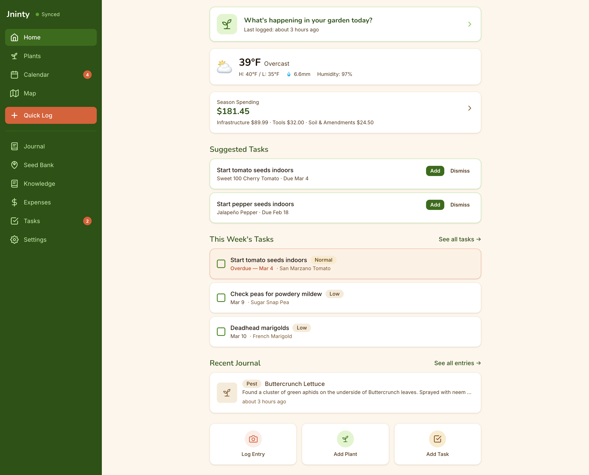
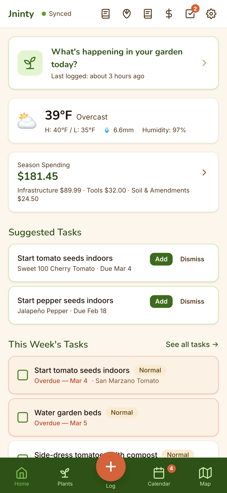

<!-- Project logo placeholder — replace with actual logo when ready -->

# Jninty

[](LICENSE)
[](https://github.com/HapiCreative/jninty/actions/workflows/ci.yml)


**A local-first, open-source garden journal and management PWA.** All data lives on your device in IndexedDB — no account required, works offline, with optional multi-device sync via CouchDB.

## Features

- **Plant Inventory** — Track plants with photos, species, care notes, and lifecycle status
- **Garden Journal** — Log daily activities with photos, linked to specific plants
- **Quick Log** — 3-tap photo-first workflow for fast field notes
- **Plant Knowledge Base** — Built-in growing guides for vegetables, herbs, fruits, and flowers with scheduling, spacing, and companion info — plus user-contributed entries
- **Planting Calendar** — Timeline, yearly, and monthly views for crop scheduling and season planning
- **Task Management** — Create, prioritize, and track garden tasks with due dates
- **Task Rules** — Automated task generation from plant care schedules
- **Garden Map** — Visual garden bed layout editor
- **Seed Bank** — Track seed inventory with sow-by dates and germination rates
- **Seasons & Plantings** — Season-based planting records with frost date awareness and year-over-year comparison
- **Expense Tracking** — Track garden spending by category and store with per-season filtering
- **Full-Text Search** — Instant search across plants and journal entries
- **Data Export/Import** — ZIP backup and restore
- **Dark Mode** — System-aware and manual theme switching
- **Accessibility** — High contrast mode, adjustable font size, keyboard shortcuts
- **Push Notifications** — Task reminders and frost alerts
- **Multi-Device Sync** — Optional CouchDB replication (see below)
- **PWA** — Install on any device, full offline support
- **No Account Required** — Everything stays on your device

## Screenshots

<p align="center">
  
</p>

<p align="center">
  
</p>

<p align="center">
  
</p>

<p align="center">
  
</p>

<p align="center">
  
</p>

<p align="center">
  
</p>

## Quick Start

```bash
git clone https://github.com/HapiCreative/jninty.git
cd jninty
npm install
npm run dev
```

Open [http://localhost:5173](http://localhost:5173) in your browser.

### Commands

```bash
npm run dev          # Vite dev server
npm run build        # TypeScript type-check + production build
npm run preview      # Preview production build
npm run lint         # ESLint
npm run test         # Run tests (single run)
npm run test:watch   # Run tests (watch mode)
```

## Tech Stack

| Layer | Technology |
|-------|-----------|
| Framework | React 18 + TypeScript (strict mode) |
| Build | Vite |
| Styling | Tailwind CSS v4 |
| Database | PouchDB (IndexedDB) + optional CouchDB sync |
| Routing | React Router DOM v7 |
| Search | MiniSearch |
| Validation | Zod |
| Dates | date-fns |
| Canvas | Konva.js (garden map) |
| PWA | vite-plugin-pwa + Workbox |
| Testing | Vitest + Testing Library |

## Architecture

```
src/
  pages/              Route-level page components
  components/         Shared UI components
  components/ui/      Primitives (Button, Card, Input, Badge, Toast, Skeleton)
  components/layout/  Layout (AppShell — sidebar + bottom nav)
  db/pouchdb/         PouchDB client, repositories, search index
  hooks/              Custom React hooks
  services/           Business logic (calendar, taskEngine, knowledgeBase, photoProcessor, exporter)
  validation/         Zod schemas for all entities
  types/              TypeScript type definitions
  constants/          Label and option constants
data/
  plants/             Built-in plant knowledge base JSON (vegetables, herbs, fruits, flowers)
sync/
  docker-compose.yml  CouchDB setup for multi-device sync
  setup.sh            One-command sync server setup
```

All data is stored in IndexedDB via PouchDB. Documents are prefixed with a `docType` (e.g. `plant:uuid`) for type isolation in the single-database model. Every entity includes `id`, `version`, `createdAt`, `updatedAt`, and `deletedAt` fields.

## Multi-Device Sync

Want to sync your garden journal between your phone and desktop? Jninty supports optional CouchDB replication over your local network.

### Setup

1. **Install Docker** if you don't have it already
2. **Start the sync server:**
   ```bash
   cd sync
   cp .env.example .env    # Edit credentials if desired
   ./setup.sh              # Starts CouchDB + configures CORS
   ```
3. **Connect from the app:** Go to Settings > Multi-Device Sync, paste the URL printed by the setup script, and tap "Start Sync"

### How It Works

- CouchDB runs in Docker on your machine, listening on port 5984
- The setup script configures CORS so the browser can talk to CouchDB directly
- Jninty auto-detects your LAN IP so other devices on the same network can connect
- Sync is bidirectional — changes on any device propagate to all others

### Connecting Your Phone

1. Make sure your phone is on the same Wi-Fi network as your desktop
2. Open Jninty on your phone's browser
3. In Settings > Multi-Device Sync, enter the sync URL using your desktop's LAN IP (e.g. `http://192.168.1.100:5984/jninty`)

### Troubleshooting

| Problem | Solution |
|---------|----------|
| Phone can't reach sync server | Check that both devices are on the same network. Ensure your firewall allows port 5984 |
| Mixed content error (HTTPS) | The Vite dev server proxies CouchDB requests to avoid mixed-content issues. In production, serve the app over HTTP, or set up HTTPS on CouchDB |
| Wrong LAN IP detected | Manually enter the correct IP. Find it with `ifconfig` (macOS/Linux) or `ipconfig` (Windows) |
| Sync conflicts | Jninty uses PouchDB's automatic conflict resolution. The most recent write wins |

For more details, see [sync/README.md](sync/README.md).

## Cloud Sync (Optional)

For syncing across networks (not just LAN), you can host CouchDB on a remote server:

1. **Set up a VPS** with Docker and run the same `sync/docker-compose.yml`
2. **Enable HTTPS** — CouchDB must be behind a reverse proxy (nginx, Caddy) with a valid TLS certificate, since browsers block mixed HTTP/HTTPS content
3. **Update credentials** — Change the default admin password in `.env` before exposing to the internet
4. **Point Jninty at the remote URL** — e.g. `https://couch.yourdomain.com/jninty`

## Design Document

The full project design, architecture decisions, data model, and phased roadmap are documented in [`docs/plans/Jninty-Design-v1.md`](docs/plans/Jninty-Design-v1.md).

## Contributing

Contributions are welcome! See [CONTRIBUTING.md](CONTRIBUTING.md) for development setup, code guidelines, and how to submit changes.

Plant data contributions are especially appreciated — you can add new species to the knowledge base without writing any application code.

## License

[MIT](LICENSE)
