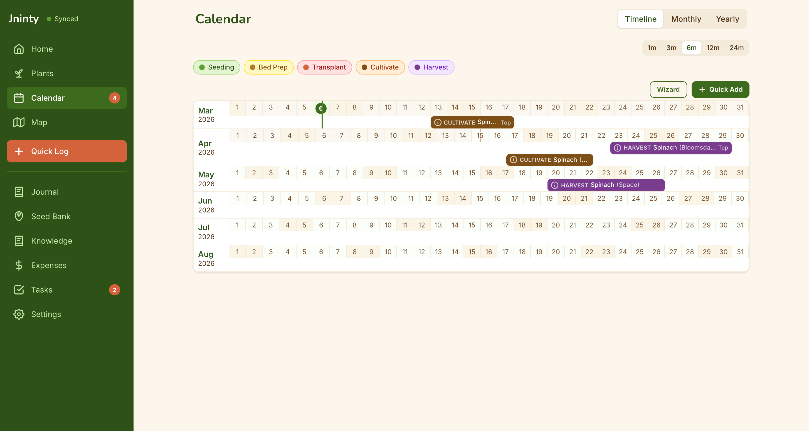
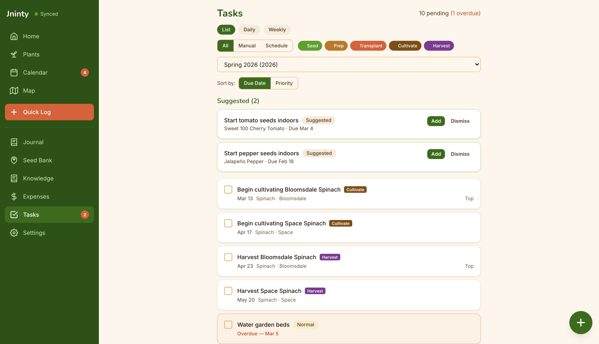
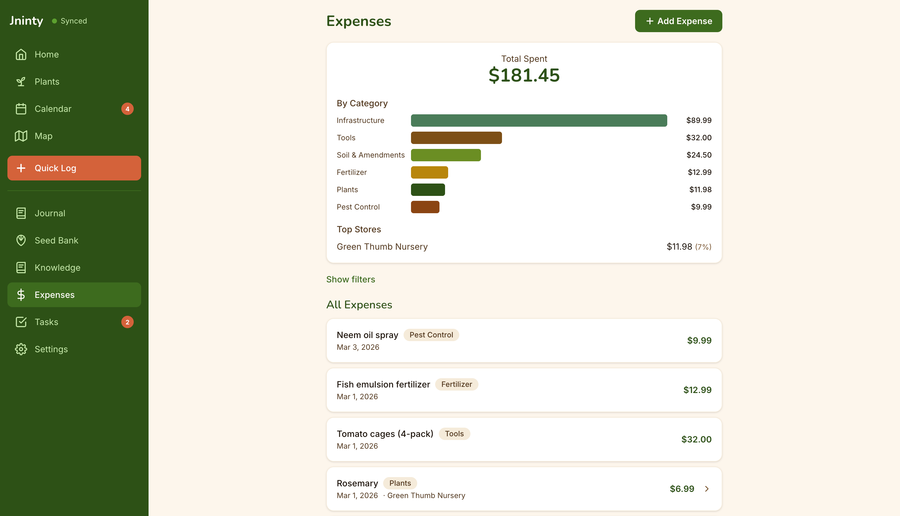

> This repository is a translated copy of the original project at https://github.com/HapiCreative/jninty and has been adapted to German.

<!-- Project logo placeholder - replace with actual logo when ready -->

# Jninty

[](LICENSE)
[](https://github.com/HapiCreative/jninty/actions/workflows/ci.yml)


[](https://jninty.com)

**Ein Local-First-, Open-Source-Gartenjournal und Verwaltungs-PWA.** Alle Daten liegen auf deinem Geraet in IndexedDB, es ist kein Konto erforderlich, die App funktioniert offline und kann optional ueber CouchDB zwischen mehreren Geraeten synchronisiert werden.

## Funktionen

- **Pflanzenbestand** - Pflanzen mit Fotos, Art, Pflegenotizen und Lebenszyklusstatus verwalten
- **Gartenjournal** - Taegliche Aktivitaeten mit Fotos dokumentieren und mit bestimmten Pflanzen verknuepfen
- **Schnellprotokoll** - Foto-zentrierter 3-Tap-Ablauf fuer schnelle Notizen im Garten
- **Wissensbasis fuer Pflanzen** - Integrierte Anbauhinweise fuer Gemuese, Kraeuter, Obst und Blumen mit Zeitplanung, Abstaenden und Mischkulturinfos sowie eigene Eintraege
- **Pflanzkalender** - Zeitachsen-, Jahres- und Monatsansichten fuer Anbauplanung und Saisonorganisation
- **Aufgabenverwaltung** - Gartenaufgaben anlegen, priorisieren und nachverfolgen
- **Aufgabenregeln** - Automatische Erstellung von Aufgaben aus Pflegeplaenen
- **Gartenkarte** - Visueller Editor fuer Beete und Gartenflaechen
- **Saatgutbank** - Saatgutbestand mit Aussaatdaten und Keimraten verwalten
- **Saisons und Pflanzungen** - Saisonbasierte Pflanzungsdaten mit Frostterminen und Jahresvergleich
- **Ausgabenverwaltung** - Gartenausgaben nach Kategorien und Saison filtern
- **Volltextsuche** - Schnelle Suche ueber Pflanzen und Journaleintraege
- **Datenexport/-import** - ZIP-Backup und Wiederherstellung
- **Dunkelmodus** - Systembewusstes oder manuelles Umschalten des Themes
- **Barrierefreiheit** - Hoher Kontrast, anpassbare Schriftgroesse und Tastaturkuerzel
- **Push-Benachrichtigungen** - Erinnerungen fuer Aufgaben und Frostwarnungen
- **Multi-Device-Sync** - Optionale CouchDB-Replikation
- **PWA** - Installierbar auf jedem Geraet mit voller Offline-Unterstuetzung
- **Kein Konto erforderlich** - Alles bleibt auf deinem Geraet. Optional kannst du [Jninty Cloud](https://jninty.com) fuer Multi-Device-Sync und Cloud-Backups nutzen

## Jninty Cloud

Du moechtest keinen eigenen Sync-Server betreiben? [**Jninty Cloud**](https://jninty.com) bietet automatische Synchronisation zwischen Geraeten, verschluesselte Cloud-Backups und Zugriff von ueberall, ohne Docker, VPS oder Setup.

**4,99 USD/Monat oder 49,99 USD/Jahr** - [Jetzt starten auf jninty.com](https://jninty.com)

Jninty ist und bleibt vollstaendig Open Source und selbst hostbar. Die Cloud ist eine optionale Komfortfunktion.

## Screenshots

<p align="center">
  
</p>

<p align="center">
  
</p>

<p align="center">
  
</p>

<p align="center">
  
</p>

<p align="center">
  
</p>

<p align="center">
  
</p>

## Schnellstart

```bash
git clone https://github.com/HapiCreative/jninty.git
cd jninty
npm install
npm run dev
```

Oeffne [http://localhost:5173](http://localhost:5173) im Browser.

### Befehle

```bash
npm run dev          # Vite-Entwicklungsserver
npm run build        # TypeScript-Check + Produktions-Build
npm run preview      # Produktions-Build lokal ansehen
npm run lint         # ESLint
npm run test         # Tests einmalig ausfuehren
npm run test:watch   # Tests im Watch-Modus ausfuehren
```

## Tech-Stack

| Ebene | Technologie |
|-------|-------------|
| Framework | React 18 + TypeScript (strict mode) |
| Build | Vite |
| Styling | Tailwind CSS v4 |
| Datenbank | PouchDB (IndexedDB) + optionaler CouchDB-Sync |
| Routing | React Router DOM v7 |
| Suche | MiniSearch |
| Validierung | Zod |
| Datumslogik | date-fns |
| Canvas | Konva.js (Gartenkarte) |
| PWA | vite-plugin-pwa + Workbox |
| Tests | Vitest + Testing Library |

## Architektur

```text
src/
  pages/              Seitenkomponenten auf Routenebene
  components/         Gemeinsame UI-Komponenten
  components/ui/      Primitive Bausteine (Button, Card, Input, Badge, Toast, Skeleton)
  components/layout/  Layout (AppShell - Sidebar + Bottom Navigation)
  db/pouchdb/         PouchDB-Client, Repositories, Suchindex
  hooks/              Eigene React Hooks
  services/           Fachlogik (calendar, taskEngine, knowledgeBase, photoProcessor, exporter)
  validation/         Zod-Schemata fuer alle Entitaeten
  types/              TypeScript-Typdefinitionen
  constants/          Labels und Optionskonstanten
data/
  plants/             Integrierte JSON-Wissensbasis fuer Pflanzen
sync/
  docker-compose.yml  CouchDB-Setup fuer Multi-Device-Sync
  setup.sh            Ein-Kommando-Setup fuer den Sync-Server
```

Alle Daten werden ueber PouchDB in IndexedDB gespeichert. Dokumente tragen ein `docType`-Praefix, zum Beispiel `plant:uuid`, damit Entitaeten im Ein-Datenbank-Modell sauber getrennt bleiben. Jede Entitaet enthaelt `id`, `version`, `createdAt`, `updatedAt` und `deletedAt`.

## Multi-Device-Sync

Du willst dein Gartenjournal zwischen Smartphone und Desktop synchronisieren? Jninty unterstuetzt optionale CouchDB-Replikation im lokalen Netzwerk.

### Einrichtung

1. **Docker installieren**, falls noch nicht vorhanden
2. **Sync-Server starten:**
   ```bash
   cd sync
   cp .env.example .env    # Zugangsdaten bei Bedarf anpassen
   ./setup.sh              # Startet CouchDB und richtet CORS ein
   ```
3. **In der App verbinden:** Unter Einstellungen > Multi-Device-Sync die vom Script ausgegebene URL eintragen und auf `Sync starten` tippen

### So funktioniert es

- CouchDB laeuft in Docker auf deinem Rechner und lauscht auf Port 5984
- Das Setup-Script richtet CORS ein, damit der Browser direkt mit CouchDB sprechen kann
- Jninty erkennt automatisch deine LAN-IP, damit andere Geraete im selben Netzwerk zugreifen koennen
- Die Synchronisation ist bidirektional, Aenderungen auf einem Geraet werden auf alle anderen uebertragen

### Smartphone verbinden

1. Sicherstellen, dass das Smartphone im selben WLAN wie der Desktop ist
2. Jninty im Browser des Smartphones oeffnen
3. In Einstellungen > Multi-Device-Sync die Sync-URL mit der LAN-IP des Desktops eintragen, z. B. `http://192.168.1.100:5984/jninty`

### Fehlerbehebung

| Problem | Loesung |
|---------|---------|
| Smartphone erreicht den Sync-Server nicht | Pruefen, ob beide Geraete im selben Netzwerk sind und die Firewall Port 5984 erlaubt |
| Mixed-Content-Fehler (HTTPS) | Der Vite-Dev-Server kann CouchDB-Anfragen proxyen. In Produktion die App ueber HTTP ausliefern oder HTTPS fuer CouchDB einrichten |
| Falsche LAN-IP erkannt | Korrekte IP manuell eintragen. Unter macOS/Linux mit `ifconfig`, unter Windows mit `ipconfig` |
| Sync-Konflikte | Jninty verwendet die automatische Konfliktaufloesung von PouchDB. Der letzte Schreibvorgang gewinnt |

Weitere Details stehen in [sync/README.md](sync/README.md).

## Cloud-Sync (optional)

Der einfachste Weg fuer gerateuebergreifende Synchronisation ist [**Jninty Cloud**](https://jninty.com): automatische Synchronisierung, verschluesselte Backups und kein Einrichtungsaufwand.

Wenn du lieber selbst hostest, kannst du CouchDB auf einem entfernten Server betreiben:

1. **VPS einrichten** und das vorhandene `sync/docker-compose.yml` verwenden
2. **HTTPS aktivieren** - CouchDB muss hinter einem Reverse Proxy wie nginx oder Caddy mit gueltigem TLS-Zertifikat laufen, da Browser gemischte HTTP/HTTPS-Inhalte blockieren
3. **Zugangsdaten anpassen** - Das Standard-Admin-Passwort in `.env` vor der Internetfreigabe aendern
4. **Jninty auf die Remote-URL zeigen lassen** - zum Beispiel `https://couch.example.com/jninty`

## Designdokument

Das vollstaendige Projektdesign, Architekturentscheidungen, Datenmodell und die Roadmap stehen in [`docs/plans/Jninty-Design-v1.md`](docs/plans/Jninty-Design-v1.md).

## Mitwirken

Beitraege sind willkommen. Siehe [CONTRIBUTING.md](CONTRIBUTING.md) fuer Entwicklungssetup, Code-Richtlinien und den Ablauf fuer Aenderungen.

Besonders hilfreich sind Ergaenzungen der Pflanzendaten, neue Arten fuer die Wissensbasis koennen ohne Aenderungen an der App-Logik hinzugefuegt werden.

## Lizenz

[MIT](LICENSE)
